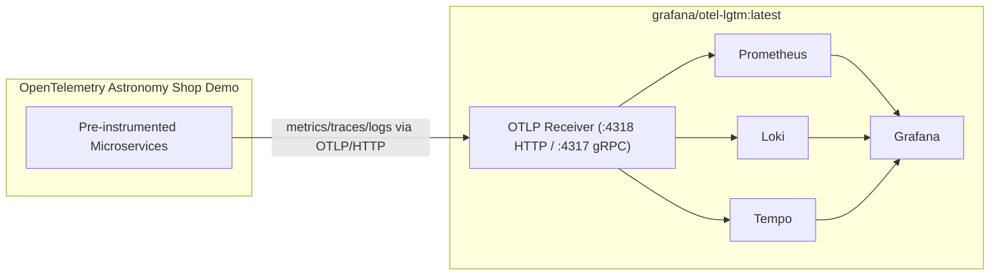

# Architecture

## System Diagram (Mermaid)

## Data Flow

1. Demo services emit telemetry with OpenTelemetry SDKs.
2. Telemetry is exported to `http://grafana-lgtm:4318` (OTLP/HTTP).
3. LGTM collector routes:
   - metrics → Prometheus
   - logs → Loki
   - traces → Tempo
4. Grafana visualizes all signals via provisioned datasources and dashboards.

## Team Role Assignment (6 Engineers)

| Engineer | Primary Role | Scope |
|---|---|---|
| Engineer 1 | Platform Lead | Compose runtime, networking, resource controls |
| Engineer 2 | Observability Engineer | Datasource provisioning, correlation configs |
| Engineer 3 | Dashboard Engineer | Golden Signals dashboard design and maintenance |
| Engineer 4 | SRE Engineer | Alert rules, notification routing, on-call tuning |
| Engineer 5 | Reliability QA | Validation scripts, config checks, smoke testing |
| Engineer 6 | Documentation Lead | Runbooks, onboarding, sprint reporting |

## Correlation Model

- **Trace → Logs:** Tempo is configured with `tracesToLogsV2` to pivot from a selected trace/span into Loki logs filtered by trace/span identifiers and service tags.
- **Trace → Metrics:** Tempo `tracesToMetrics` links trace context to Prometheus queries for rapid latency/error triage.
- **Metrics ↔ Traces (Exemplars):** Prometheus datasource is configured with exemplar destinations so trace IDs can be opened directly from supporting metric datapoints.
